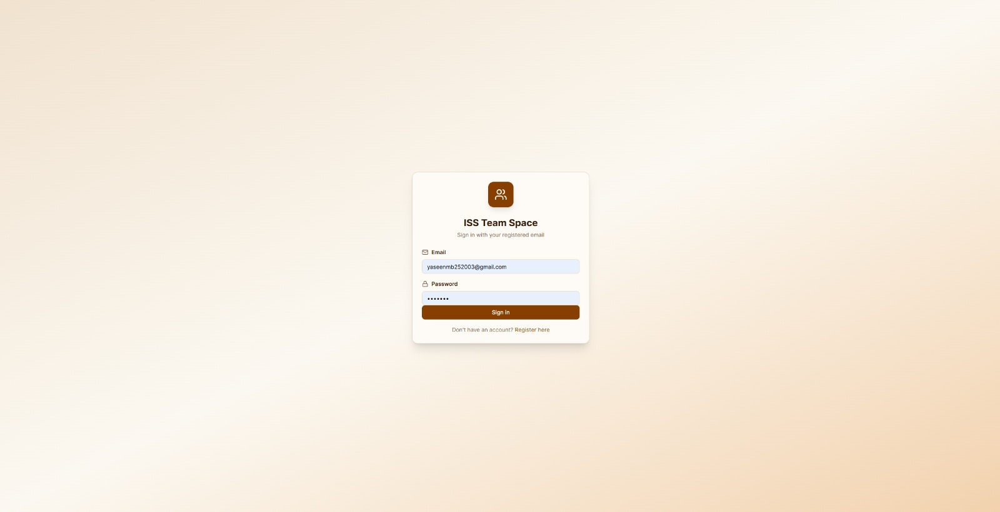
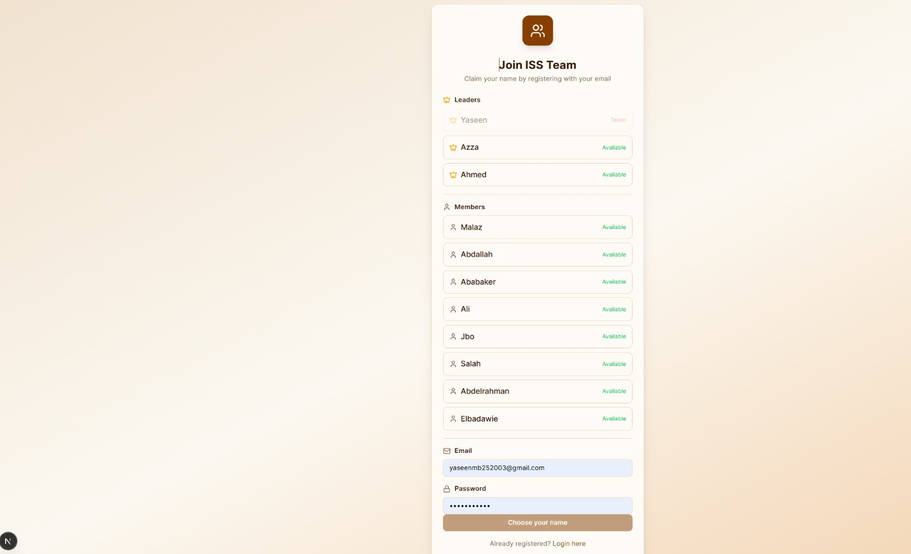
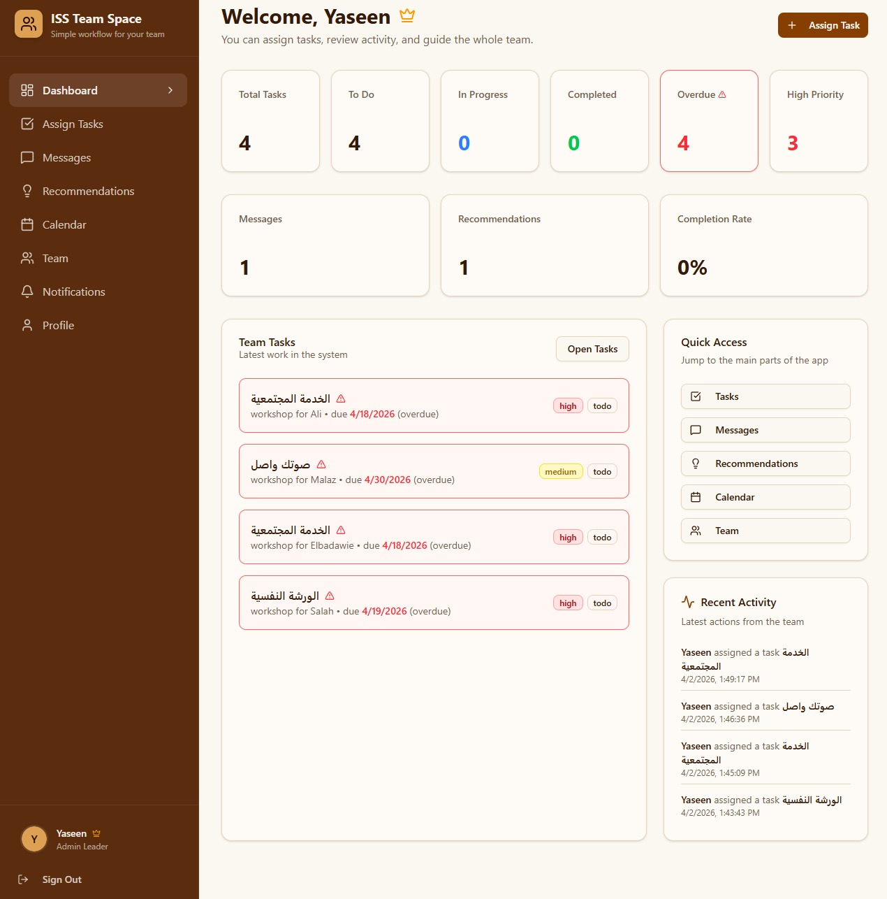
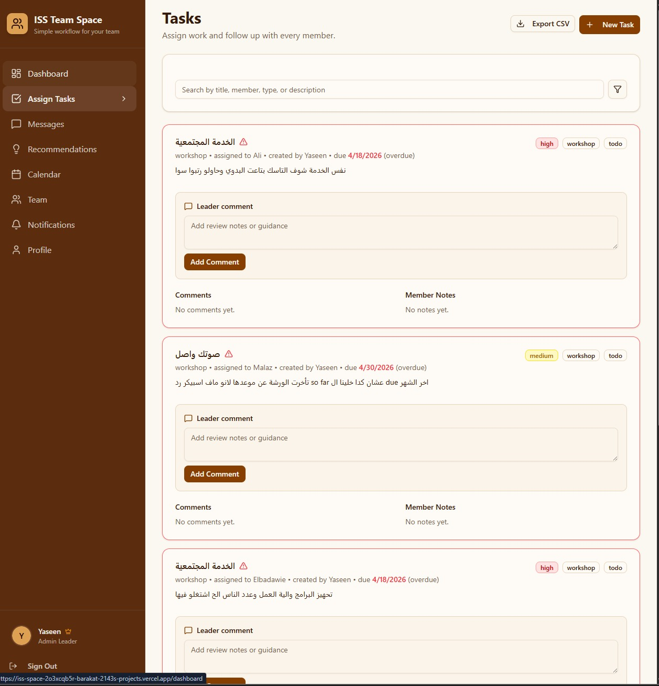
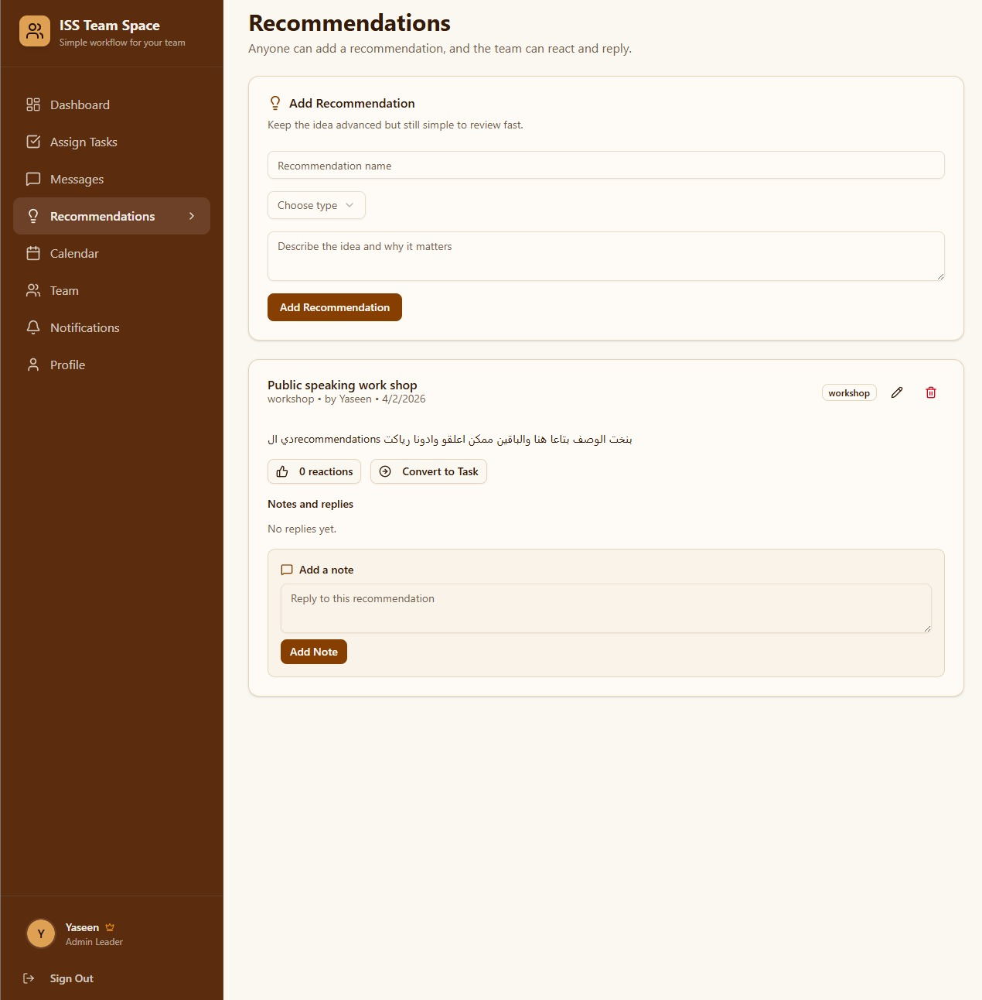
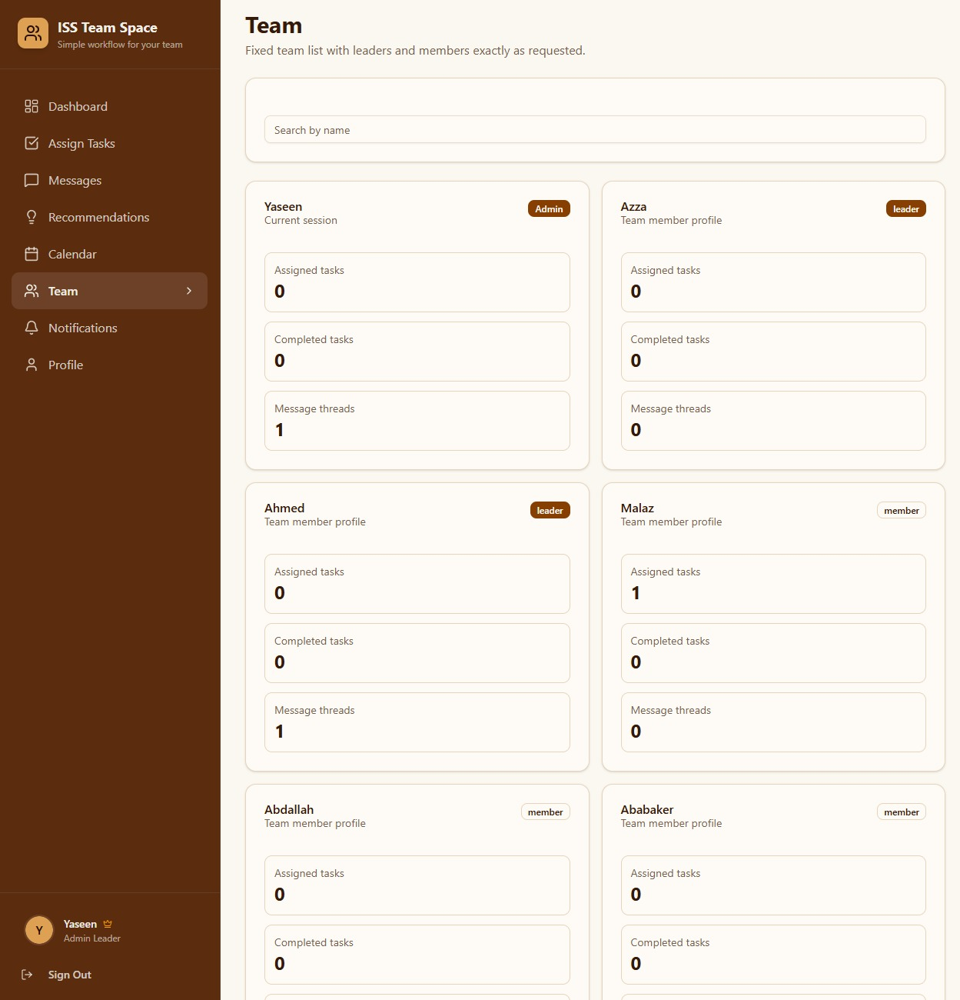

# ISS Team Space

A simple team collaboration system built with **Next.js**, **TypeScript**, and **MongoDB** for the ISS team workflow.

This project is designed for a small internal team with fixed user names and clear roles:

- `Yaseen` can assign tasks to members only.
- `Azza` and `Ahmed` can review tasks and add leader comments.
- Members can view their own tasks, add notes, update progress, send direct messages, and join recommendations.

## Main Features

- Fixed team registration and login flow
- Role-based dashboard and permissions
- Task assignment by `Yaseen` only
- Leader comments by `Azza` and `Ahmed`
- Member task notes and status updates
- Direct messages between team users
- Recommendations with notes and reactions
- Calendar generated automatically from task due dates
- MongoDB-backed API with local fallback support

## Screenshots

### Login



### Registration



### Dashboard



### Tasks



### Recommendations



### Team



## Team Roles

### Leaders

- `Yaseen` -> admin leader
- `Azza` -> leader
- `Ahmed` -> leader

### Members

- `Malaz`
- `Abdallah`
- `Ababaker`
- `Ali`
- `Jbo`
- `Salah`
- `Abdelrahman`
- `Elbadawie`

## Tech Stack

- Next.js 16
- React 19
- TypeScript
- Tailwind CSS
- MongoDB
- Radix UI
- Lucide Icons

## Project Structure

```bash
app/
  api/
  dashboard/
  (auth)/
components/
contexts/
data/
hooks/
lib/
types/
public/
docs/
```

## Environment Variables

Create a `.env.local` file in the project root:

```env
MONGODB_URI=your_mongodb_connection_string
MONGODB_DB=Sudan
SESSION_SECRET=your_session_secret
APP_PASSWORD=your_shared_app_password
```

## Run Locally

Install dependencies:

```bash
npm install
```

Start the development server:

```bash
npm run dev
```

Build for production:

```bash
npm run build
```

Start production mode:

```bash
npm run start
```

## Important Notes

- If MongoDB is unavailable, the app can fall back to local JSON seed data in development.
- The login system is intentionally simple and based on a fixed team list.
- The project is built for internal team use with a clear, lightweight workflow.

## Main Pages

- `/login`
- `/register`
- `/dashboard`
- `/dashboard/tasks`
- `/dashboard/tasks/new`
- `/dashboard/messages`
- `/dashboard/recommendations`
- `/dashboard/calendar`
- `/dashboard/team`

## Deployment

You can deploy this project on **Vercel**:

1. Push the project to GitHub.
2. Import the repository into Vercel.
3. Add these environment variables:
- `MONGODB_URI`
- `MONGODB_DB`
- `SESSION_SECRET`
- `APP_PASSWORD`
4. Redeploy the project.

## Status

This project is completed in its requested scope:

- Role-based task workflow
- Recommendations and notes
- Direct messaging
- Calendar integration
- MongoDB-ready backend

## Author

Built for the ISS team workflow project.
